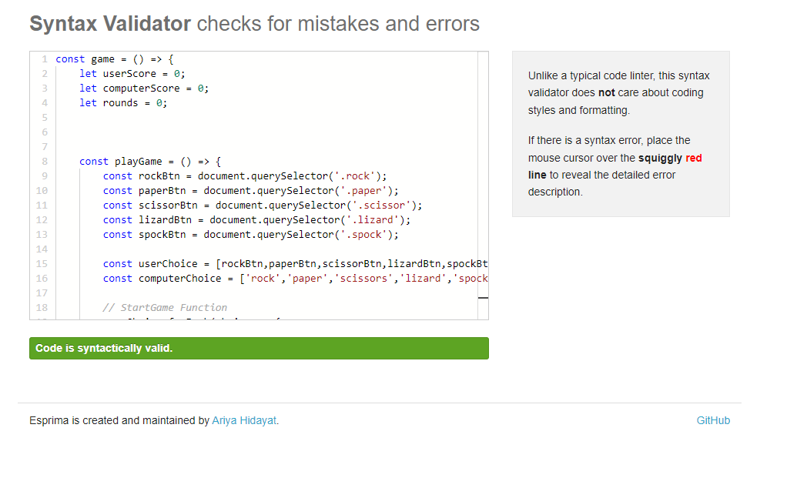

<h1>Welcome to my REMADE Project nr.2!</h1>

This was the first time trying javascript and I can honstly say, I need to focus more on this.
But, this is my remade version. And I am proud with the progress.
The rules to decide winner was a treat to figure out, since applying 2 alternatives per choice caused crashes. But Im proud with this project.
Although I am happy with the result, my credit goes to ="https://www.geeksforgeeks.org/rock-paper-and-scissor-game-using-javascript/". 
This worked as a perfect guideLine to figure out where to put all the functions to make them work properly.

My old code was from following a bad example and I ended up clueless to what the codes did.
This time around though, with my new knowledge, gave me the possibilities to write, adapt and troubleshoot my codes with ease.
And I had a blast.

<h2>The rules for the game is simple..
Pick a choice, and make the right one. 
If you don't, the computer gets the score, but if you do, then you'll get the score.
</h2>

Rock beats: Scissors and Lizard
Sciccors beats: Paper and Lizard
Paper beats: Rock and Spock
Lizard beats: Spock and Paper
Spock beats: Scissors and Rock

My code has been validated through: https://validator.w3.org/,  https://jigsaw.w3.org/css-validator/ and https://esprima.org/demo/validate.html

I did get a error on my CSS. The problem that exist according to the validator is that the upscaling doesn't exist. I have checked my code several times to make sure it works properly.

Good Luck!